# CONFER (English): prompt benchmarking results

This directory contains the English-only CONFER prompt-benchmarking materials inside `presuppositions-all/prompt_benchmarking/`.

Primary data files in this folder:

- `presupposition_input.csv`
- `presupposition_answers.csv`

These are the input and gold files used by the CONFER scorer in `../scripts/batch_scorer_CONFER.py`.

## Executive summary

Across the high-integrity CONFER English runs, **P1 remains the strongest prompt overall**. It is the best-performing prompt across both **Chat 5.4** and **Opus 4.6**, and it also remains the clearest all-around winner once we compare probability-based prompts against their hard-label counterparts.

Three conclusions stand out:

1. **Benchmark-shaped few-shot examples help a lot.** P1 consistently beats the minimal baseline (`P0`) and the more formal rule-based prompts (`P2`, `P4`, `P5`, `P6`, `P7`).
2. **Probability output helps.** Within the prompt families where we tested both formats, the probability versions outperform the hard-label versions.
3. **Prompt tuning is model-specific.** `P2` is much stronger than `P4` on Chat 5.4, while `P4` is much stronger than `P2` on Opus 4.6.

The broad pattern is that **light-touch, benchmark-aligned example anchoring works better than either minimal prompting or heavier semantic/rule scaffolding**.

## Inclusion rule

This write-up includes only the runs we consider **high-integrity and comparable**:

- probabilistic runs with full dataset coverage and valid scorer output
- hard-label runs with complete 300-item outputs and manually computed summary metrics

We **exclude** the `P13`, `P13_redux`, `P14`, and `P15` family from the main analysis because those outputs had substantial integrity failures such as partial coverage, repeated blocks, or mismatched item IDs. Those runs are useful as prompt-development attempts, but not as fair model-comparison evidence.

## 1) Included prompt families

| Prompt | Output | Family | Working role |
|---|---|---|---|
| `P0` | Probabilities | Minimal baseline | Lets the model infer the task from the dataset alone |
| `P1` | Probabilities | Few-shot, benchmark-shaped examples | Main best-performing prompt |
| `P1_redux` | Probabilities | Exploratory `P1` variant | Strong Chat-only follow-up variant |
| `P2` | Probabilities | Guarantee-based NLI decision rule | Strong generic non-few-shot Chat alternative |
| `P4` | Probabilities | Symmetric definitely-true / definitely-false rule | Strong structured Opus alternative |
| `P5` | Probabilities | Compatibility then determination | Lower-performing rule-heavy variant |
| `P6` | Probabilities | Independent E / C / N tests | Lower-performing rule-heavy variant |
| `P7` | Probabilities | Explicit presupposition / projection definitions | Task-specific wording without examples |
| `P8` | Hard label | Hard-label counterpart to `P7` | Tests no-probability version of projection-aware prompt |
| `P10` | Hard label | Hard-label counterpart to `P1` | Tests no-probability version of few-shot prompt |
| `P12` | Hard label | Hard-label counterpart to `P2` | Tests no-probability version of guarantee-based prompt |

## 2) Master results tables

### Table 1. Chat 5.4 included runs

| Prompt | Output | Family | Accuracy | Macro-F1 | Log Loss | Brier | F1-E | F1-N | F1-C | Integrity |
|---|---|---|---:|---:|---:|---:|---:|---:|---:|---|
| `P1` | Probabilities | Few-shot examples | **0.7867** | **0.7841** | 0.6815 | 0.3686 | 0.8722 | **0.6923** | 0.7879 | Full scorer coverage |
| `P1_redux` | Probabilities | Exploratory `P1` variant | **0.8000** | 0.7779 | **0.6034** | **0.3450** | 0.7984 | 0.5833 | **0.9519** | Full scorer coverage |
| `P2` | Probabilities | Guarantee-based NLI | 0.7100 | 0.7094 | 0.8589 | 0.4917 | 0.7845 | 0.5700 | 0.7738 | Full scorer coverage |
| `P0` | Probabilities | Minimal baseline | 0.6933 | 0.6828 | 0.9081 | 0.5244 | 0.7857 | 0.4889 | 0.7738 | Full scorer coverage |
| `P10` | Hard label | `P1` mirror | 0.6000 | 0.5645 | — | — | 0.7200 | 0.2323 | 0.7412 | Manual full-set scoring |
| `P4` | Probabilities | Symmetric rule-based NLI | 0.4767 | 0.4644 | 1.6368 | 0.9029 | 0.4106 | 0.5094 | 0.4733 | Full scorer coverage |
| `P5` | Probabilities | Compatibility then determination | 0.4700 | 0.4563 | 1.5819 | 0.8962 | 0.3893 | 0.5062 | 0.4733 | Full scorer coverage |
| `P6` | Probabilities | Independent E / C / N tests | 0.4700 | 0.4563 | 1.5028 | 0.8689 | 0.3893 | 0.5062 | 0.4733 | Full scorer coverage |
| `P12` | Hard label | `P2` mirror | 0.4700 | 0.4563 | — | — | 0.3893 | 0.5062 | 0.4733 | Manual full-set scoring |
| `P7` | Probabilities | Explicit presupposition definitions | 0.4567 | 0.4042 | 1.8956 | 0.9854 | 0.6875 | 0.0355 | 0.4895 | Full scorer coverage |
| `P8` | Hard label | `P7` mirror | 0.3467 | 0.1888 | — | — | 0.0588 | 0.5075 | 0.0000 | Manual full-set scoring |

### Table 2. Opus 4.6 included runs

| Prompt | Output | Family | Accuracy | Macro-F1 | Log Loss | Brier | F1-E | F1-N | F1-C | Integrity |
|---|---|---|---:|---:|---:|---:|---:|---:|---:|---|
| `P1` | Probabilities | Few-shot examples | **0.9200** | **0.9192** | **0.3649** | **0.1618** | 0.8959 | **0.8667** | **0.9950** | Full scorer coverage |
| `P4` | Probabilities | Symmetric rule-based NLI | 0.8633 | 0.8626 | 0.5004 | 0.2483 | **0.9688** | 0.8313 | 0.7879 | Full scorer coverage |
| `P2` | Probabilities | Guarantee-based NLI | 0.6833 | 0.6601 | 0.8197 | 0.5040 | 0.8750 | 0.6801 | 0.4252 | Full scorer coverage |
| `P0` | Probabilities | Minimal baseline | 0.6033 | 0.5700 | 1.0121 | 0.6163 | 0.7046 | 0.2222 | 0.7831 | Full scorer coverage |

### Table 3. Cross-model comparison for prompts run on both models

| Prompt | Chat 5.4 Acc | Chat 5.4 Macro-F1 | Opus 4.6 Acc | Opus 4.6 Macro-F1 | Opus - Chat Δ Acc | Opus - Chat Δ Macro-F1 |
|---|---:|---:|---:|---:|---:|---:|
| `P0` | 0.6933 | 0.6828 | 0.6033 | 0.5700 | -0.0900 | -0.1128 |
| `P1` | **0.7867** | **0.7841** | **0.9200** | **0.9192** | +0.1333 | +0.1351 |
| `P2` | 0.7100 | 0.7094 | 0.6833 | 0.6601 | -0.0267 | -0.0493 |
| `P4` | 0.4767 | 0.4644 | 0.8633 | 0.8626 | +0.3866 | +0.3982 |

## 3) Hard-label versus probability output

### Table 4. Family-level comparison: probability vs hard-label

| Family | Probability prompt | Accuracy | Macro-F1 | F1-E | F1-N | F1-C | Hard-label prompt | Accuracy | Macro-F1 | F1-E | F1-N | F1-C |
|---|---|---:|---:|---:|---:|---:|---|---:|---:|---:|---:|---:|
| Few-shot examples | `P1` | **0.7867** | **0.7841** | 0.8722 | 0.6923 | 0.7879 | `P10` | 0.6000 | 0.5645 | 0.7200 | 0.2323 | 0.7412 |
| Guarantee-based NLI | `P2` | **0.7100** | **0.7094** | 0.7845 | 0.5700 | 0.7738 | `P12` | 0.4700 | 0.4563 | 0.3893 | 0.5062 | 0.4733 |
| Projection-aware definitions | `P7` | **0.4567** | **0.4042** | 0.6875 | 0.0355 | 0.4895 | `P8` | 0.3467 | 0.1888 | 0.0588 | 0.5075 | 0.0000 |

### Table 5. Hard-label penalty relative to probability version

| Family | Δ Accuracy | Δ Macro-F1 | Δ F1-E | Δ F1-N | Δ F1-C | Main takeaway |
|---|---:|---:|---:|---:|---:|---|
| `P1 -> P10` | -0.1867 | -0.2196 | -0.1522 | **-0.4600** | -0.0467 | Few-shot prompting remains helpful, but the probability version is much better, especially on Neutral |
| `P2 -> P12` | -0.2400 | -0.2531 | -0.3952 | -0.0638 | -0.3005 | Hard labels strongly weaken the generic guarantee-based prompt |
| `P7 -> P8` | -0.1100 | -0.2154 | **-0.6287** | +0.4720 | -0.4895 | `P8` collapses into a mostly-Neutral strategy rather than preserving `P7`'s intended distinctions |

### Table 6. Manual split accuracies for included hard-label runs

| Prompt | Family | S1 Acc | S2 Acc | S3 Acc | Mean Acc | Macro-F1 |
|---|---|---:|---:|---:|---:|---:|
| `P10` | `P1` mirror | 0.6000 | 0.5600 | 0.6400 | 0.6000 | 0.5645 |
| `P12` | `P2` mirror | 0.4500 | 0.4800 | 0.4800 | 0.4700 | 0.4563 |
| `P8` | `P7` mirror | 0.3600 | 0.3500 | 0.3300 | 0.3467 | 0.1888 |

## 4) What the results suggest

### 4.1 P1 is still the best overall prompt

`P1` remains the main winner for three reasons:

- it is the strongest prompt tested on **both models**
- it has the best **Chat 5.4 macro-F1** among the core prompt families
- it remains substantially better than its hard-label counterpart `P10`

`P1_redux` is worth noting because it slightly improves Chat 5.4 **accuracy**, **log loss**, **Brier score**, and **F1-C** relative to `P1`. But it trails `P1` on **macro-F1** and **F1-N**, and it was not run on Opus 4.6. For the main cross-model story, `P1` is still the cleanest best prompt.

### 4.2 Few-shot examples help more than heavier scaffolding

The main pattern across both models is that **benchmark-shaped examples beat more elaborate semantic or rule-based instructions**.

- `P1` beats the minimal baseline `P0`
- `P1` beats the generic guarantee-based prompt `P2`
- `P1` beats the heavier rule-based families `P4`, `P5`, and `P6`
- `P1` also beats the explicitly presupposition-aware definition prompt `P7`

That suggests the critical gain is not simply "more instructions." The gain seems to come from **teaching the benchmark's label geometry by example**.

### 4.3 Probability output is not cosmetic

The paired family comparisons make the probability effect hard to ignore.

- `P1 -> P10`: hard labels reduce both accuracy and macro-F1, with the biggest drop on **Neutral**
- `P2 -> P12`: hard labels also substantially weaken the guarantee-based prompt
- `P7 -> P8`: hard labels do not rescue the explicit presupposition-definition family

So the most careful current interpretation is:

> **The strongest results appear to come from a combination of prompt design and probability-style output, not from hard-label classification alone.**

## 5) Prompt tuning is model-specific

The clearest model-specific example is `P2` versus `P4`.

`P2` and `P4` look superficially similar, but they are not doing quite the same thing. `P2` uses a simple sequential decision rule: first ask whether the premise guarantees the hypothesis is true; if not, ask whether it guarantees the hypothesis is false; if neither is guaranteed, choose Neutral. `P4` is stricter and more symmetric: it asks the model to evaluate "definitely true?" and "definitely false?" as separate questions up front, then reconcile the answers. In practice, that extra strictness is handled very differently by different models. For **Chat 5.4**, `P2` is much stronger than `P4` (`0.7100` vs `0.4767` accuracy; `0.7094` vs `0.4644` macro-F1), which suggests the heavier rule framing may push Chat toward over-cautious or miscalibrated labeling. For **Opus 4.6**, the pattern flips: `P4` is much stronger than `P2` (`0.8633` vs `0.6833` accuracy; `0.8626` vs `0.6601` macro-F1), which suggests Opus benefits from the stricter symmetric truth/falsity audit.

```mermaid
xychart-beta
    title "P2 vs P4 Performance by Model"
    x-axis ["Chat Accuracy", "Chat Macro-F1", "Opus Accuracy", "Opus Macro-F1"]
    y-axis "Score" 0 --> 1
    bar "P2" [0.7100, 0.7094, 0.6833, 0.6601]
    bar "P4" [0.4767, 0.4644, 0.8633, 0.8626]
```

This is one of the clearest examples in the project that prompt fine-tuning is **model-specific**, not just task-specific.

## 6) Bottom line

The high-integrity CONFER English runs support a fairly clean story:

1. **P1 is the strongest overall prompt family.**
2. **Benchmark-shaped few-shot examples outperform both minimal prompting and heavier rule-based or definition-based prompts.**
3. **Probability-style output is consistently better than hard-label output within the tested prompt families.**
4. **Prompt effects are strongly model-specific, especially in the `P2` vs `P4` contrast.**

The most defensible conclusion is:

> **For CONFER English, the most effective strategy is a light-touch, benchmark-aligned few-shot prompt with probabilistic output.**

## Source notes

This summary is based on:

- the current CONFER English score dumps for Chat 5.4 and Opus 4.6
- the current prompt files in `presuppositions-all/prompt_benchmarking/prompts`
- the manually calculated hard-label metrics provided for `P8`, `P10`, and `P12`
